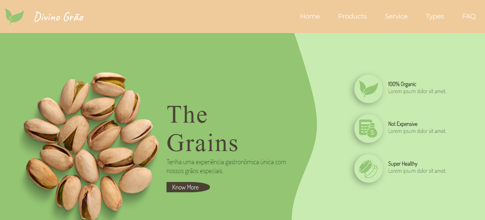

<h1 align="center">
  💻 Website - Grãos
</h1>
A proposta do projeto é um site dedicado a fornecer informações e recursos sobre uma variedade de grãos para amante da culinária de uma forma saúdavel.

## Visão Geral
No site da Divino Grão, o usuário encontrará um design que permitirá ter acesso ao catálogo dos produtos.

## Funcionalidades
- **Home**- Aqui voltará pra página inicial do site
- **Products**- Informações sobre todos os produtos disponíveis
- **Service**- Serviços oferecidos pela empresa
- **Types**- Disponibiliza lista/ catálogo dos grãos disponníveis organizados em categorias
- **FAQ**- Sessão que disponibiliza dá sua opinião ou sugestões

## 💼 Tecnologias utilizadas

Para o desenvolvimento deste site utilizei as seguintes tecnologias:
- HTML;
- CSS;
- GIT e Github